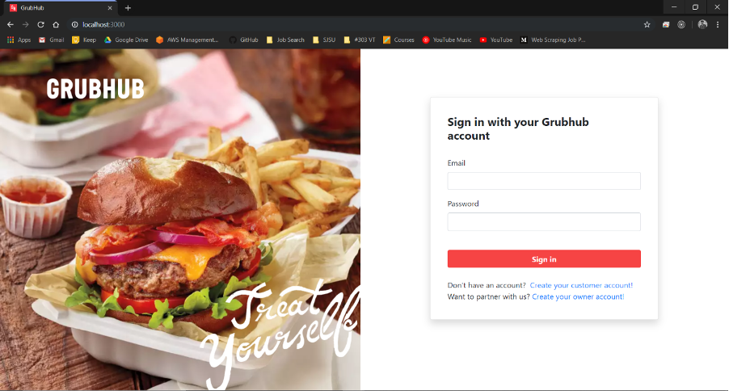
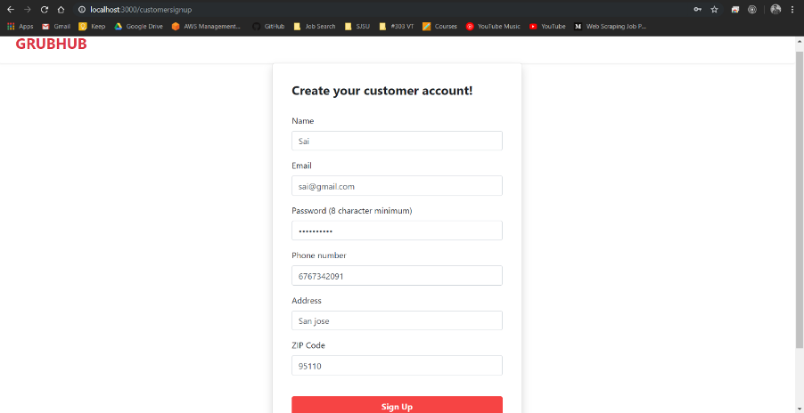
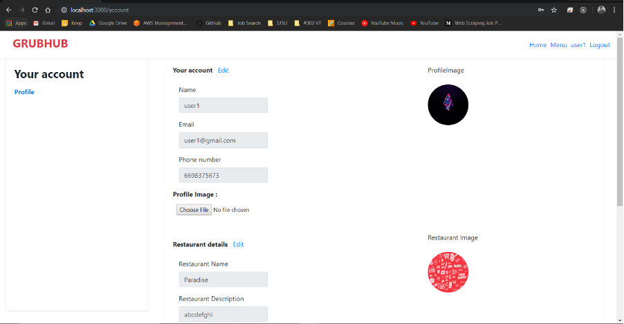
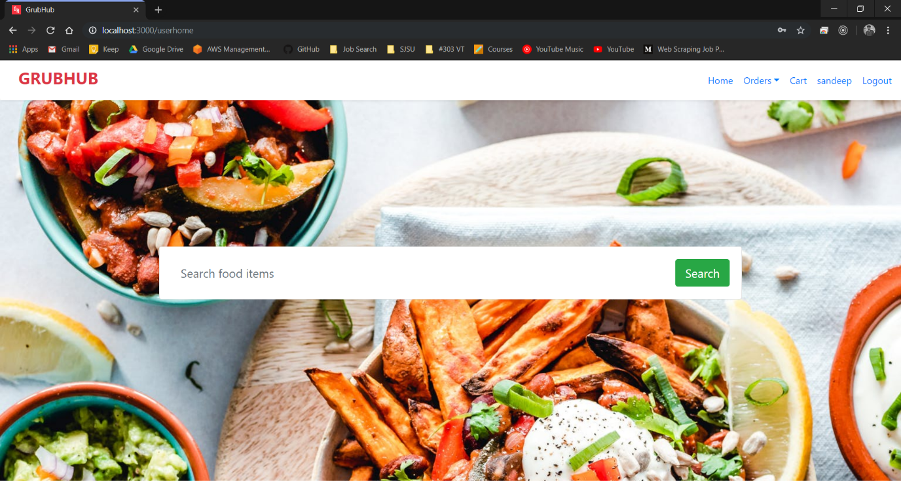
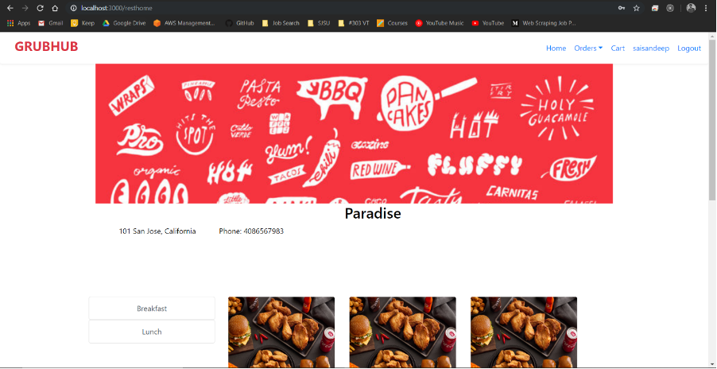
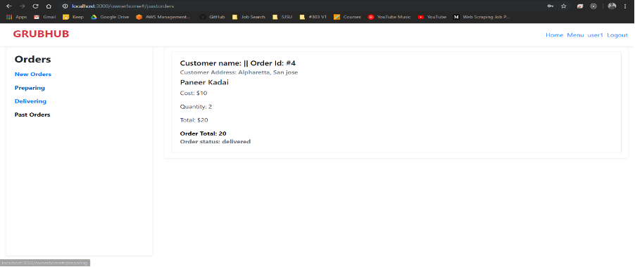

# Grubhub Simulation

[Repo Link to GraphQL version of the prototype](https://github.com/sai-sandeepj/Grubhub-Prototype-using-GraphQL)

### Technology Stack - [MERN]
MongoDB |
ExpressJS |
ReactJS |
Node.js |
Redux |
JWT |
Apache Kafka

### Steps to run the application
#### Frontend
```sh
$ cd frontend
$ npm install
$ npm start
```
#### Backend
```sh
$ cd backend
$ npm install
$ node index.js
```
#### Kafka
```sh
$ cd kafka-backend 
$ npm install
$ node server.js
```

### Application Screenshots
#### 1. Login Page


#### 2. Signup Page


#### 2. Profile Page


#### 3. Customer Home pages



#### 4. Owner Home pages


